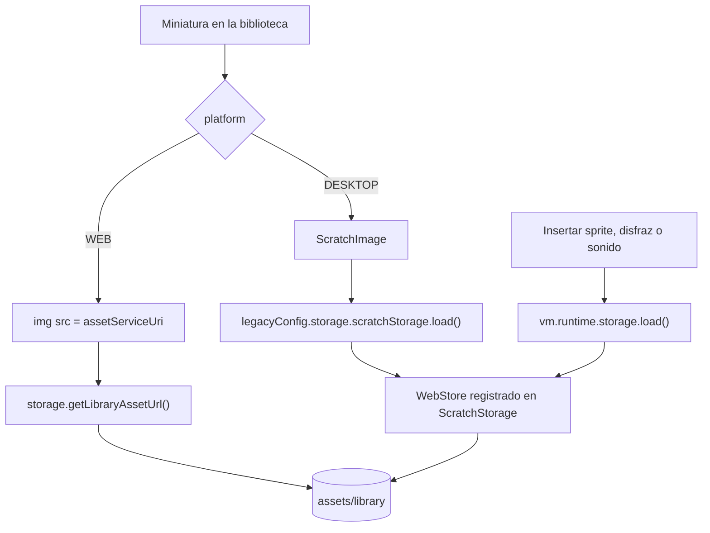

# Plan de implementación: fork de Scratch para escuelas

Este documento es la guía de trabajo del fork. Cada fase tiene objetivo,
prerrequisitos, tareas con archivos concretos, comandos y criterios de
aceptación. Una fase no se da por cerrada hasta que todos sus criterios se
cumplen y el trabajo está commiteado en `main`.

Las decisiones de arquitectura que sustentan este plan están en
[`DECISIONES.md`](./DECISIONES.md). Las referencias `D-xx` apuntan ahí.

Versiones verificadas al escribir este plan (2026-09-09):

| Componente | Versión | Nota |
|---|---|---|
| `scratchfoundation/scratch-editor` | v15.1.1 | AGPL-3.0-only, monorepo de 8 workspaces |
| Node | 24.20.0 | según `.nvmrc` de upstream |
| npm | 10.9.x | |
| `scratch-blocks` | 2.1.19 | dependencia npm precompilada, no está en el monorepo |
| `scratchfoundation/scratch-desktop` | 3.32.0 | Electron 42; pinea `@scratch/scratch-gui@13.7.4-svg` |

Nombre del producto: **ST-Playground** (D-08). Scope de los workspaces
propios: `@st-playground` (D-09).

---

## Mapa de fases

```
Fase 0  Decisiones y toolchain      sin código                       completa
Fase 1  Upstream y build verde      el repo pasa a ser el fork       completa
Fase 2  Rebranding y limpieza       packages/scratch-gui             completa
Fase 3  Biblioteca propia y offline  packages/scratch-gui + assets/    completa
Fase 4  Desktop offline             packages/st-playground-desktop   completa
Fase 5  Actividades de aula         actividades/ + links             completa
------- validar en aula -------
Fase 6  Web + LTI 1.3 + guardado    packages/st-playground-web       condicional
```

Las fases 0 a 5 producen algo instalable en una escuela sin red, con los 20
proyectos de arranque de los libros 5 a 8. La fase 6 introduce el único
backend del proyecto y se decide después de validar.

---

## Fase 0. Decisiones y toolchain

### Objetivo

Cerrar las decisiones que bloquean la fase 2 y dejar el entorno de desarrollo
alineado con upstream.

### Tareas

1. Cerrar D-08 (nombre), D-09 (scope npm) y D-10 (destino del clic en el
   logo) en `DECISIONES.md`.
2. Reemplazar el placeholder de marca en este plan.
3. Instalar la toolchain:

```bash
nvm install 24.20.0
nvm use 24.20.0
npm install -g npm@10.9.9
node --version   # v24.20.0
```

4. Agregar `.nvmrc` con `24.20.0` en la raíz. Upstream lo trae; al mergear en
   la fase 1 va a coincidir.

### Criterios de aceptación

- [x] D-08, D-09 y D-10 en estado `decidida`.
- [x] El placeholder de marca no aparece más en este archivo.
- [x] `node --version` devuelve `v24.20.0`.

---

## Fase 1. Traer upstream y build verde

### Objetivo

Convertir este repo en el fork del monorepo (D-02) y confirmar que compila y
corre sin ninguna modificación. No se toca ningún archivo de upstream en esta
fase.

### Prerrequisitos

Fase 0 completa.

### Tareas

1. Agregar upstream y traer la historia:

```bash
git remote add upstream https://github.com/scratchfoundation/scratch-editor.git
git fetch upstream --tags
git merge --allow-unrelated-histories v15.1.1
```

   Conflicto esperado: `README.md`. Resolver conservando ambos contenidos: la
   sección del fork arriba, el README de upstream debajo bajo un título
   "Upstream: scratch-editor". `PLAN_IMPLEMENTACION.md` y `DECISIONES.md` no
   existen en upstream, no conflictúan.

2. Instalar y levantar:

```bash
npm ci
for p in task-herder scratch-storage scratch-svg-renderer scratch-paint scratch-render scratch-vm; do
  NODE_ENV=production npm run build --workspace=packages/$p
done
npm start                      # webpack serve, http://localhost:8601
```

   `npm start` delega en `npm --workspace @scratch/scratch-gui start`. Los
   paquetes del workspace se resuelven por symlink y la GUI importa sus
   `dist/`, por eso hay que compilarlos antes del primer arranque; sin ese
   paso webpack falla con `Can't resolve '@scratch/scratch-storage'`.
   Anotar los tiempos en el README para dimensionar CI.

3. Build de distribución y tests unitarios de la GUI:

```bash
cd packages/scratch-gui
npm run test:unit
npm run build:dist              # dist/scratch-gui.js + dist/types/
cd ../..
```

   No correr `test:playwright` ni `test:integration` en esta fase: son lentos
   y todavía no validan nada propio.

4. Registrar en `README.md` los comandos de arranque y la política de merge de
   upstream (ver sección "Mantenimiento" al final).

### Archivos tocados

- `README.md` (resolución de conflicto)
- Nada dentro de `packages/`

### Criterios de aceptación

- [x] `git log --oneline | grep -c .` muestra la historia de upstream y
      `git remote -v` lista `upstream`.
- [x] `http://localhost:8601` abre el editor y carga el proyecto por defecto
      (el gato; en esta fase todavía es el de upstream).
- [x] `packages/scratch-gui/dist/scratch-gui.js` y
      `packages/scratch-gui/dist/types/index.d.ts` existen.
- [x] `npm run test:unit` en `packages/scratch-gui` pasa (50 suites, 328 tests).
- [x] `git diff v15.1.1 --stat -- packages/` está vacío.

### Riesgos

- `prepare` corre `husky install` en la raíz y `scripts/prepare.mjs` en la
  GUI. Si `npm ci` falla, mirar ahí primero.
- El build de webpack de la GUI consume mucha memoria. Si falla con
  `heap out of memory`, exportar `NODE_OPTIONS=--max-old-space-size=8192`.
- Upstream instala husky + commitlint: desde el merge, todos los commits
  deben seguir Conventional Commits (`chore:`, `feat:`, `docs:`...).
- Upstream trae `.github/workflows/` con semantic-release y publicación a
  npm. En este forge no corren; si el repo se mueve a GitHub hay que
  deshabilitarlos. Se registra como decisión nueva en la fase 2.

---

## Fase 2. Rebranding y limpieza de comunidad

### Objetivo

Que ninguna pantalla del flujo principal muestre la marca "Scratch" ni el
Scratch Cat, que no haya funciones de comunidad/cuenta visibles, y que no
salga telemetría ni analytics. Todo dentro de `packages/scratch-gui/` y
respetando D-05 (mínima fricción con upstream).

### Prerrequisitos

Fase 1 completa. Decisiones D-08 (`ST-Playground`), D-09
(`@st-playground`), D-10 (logo no clickeable), D-13 (tutoriales fuera) y
D-14 (i18n por alias) cerradas.

### Inventario verificado

Auditoría hecha sobre el árbol ya mergeado. Los números y líneas son reales,
no estimaciones.

| Qué | Dónde | Cantidad |
|---|---|---|
| SVG de logo y gato | `src/components/menu-bar/` | 7 archivos |
| Assets del proyecto por defecto | `src/lib/default-project/` | 2 SVG de disfraz, 2 WAV, 1 SVG de fondo |
| Archivos de tutoriales | `src/lib/libraries/decks/` | 1497 (30 mazos, 29 miniaturas, 1452 pasos) |
| Mensajes i18n con "Scratch" | `scratch-l10n` vía `reducers/locales.js` | 12 claves |
| `alt="Scratch"` en JSX | `menu-bar.jsx:337`, `stage-header.jsx:220` | 2 |
| URLs `scratch.mit.edu` en `src/` | ver 2.6 | 14 |
| Importadores de `analytics.js` | ver 2.5 | 6 archivos |
| Títulos HTML con "Scratch" | `webpack.config.js:188,195,202,209,216` | 5 |

Hallazgo relevante: `translations/en.json` no está en el repo, se genera con
`npm run i18n:src`. Por eso los textos se pisan por alias (D-14) y no
editando ese archivo.

### Tareas

Ordenadas por la regla D-05: primero assets nuevos, luego reemplazo de
assets, luego configuración, y al final los tres cambios de JSX justificados.

#### 2.1 Crear los assets de marca

Carpeta nueva `brand/` en la raíz, fuera de `packages/`, como fuente de
verdad. Desde ahí se copia a los destinos de la GUI y, en la fase 4, a los
`buildResources/` del instalador.

```
brand/
  st-playground-logo.svg          wordmark horizontal, ~110x40, para la barra de menú
  st-playground-logo-compact.svg  variante corta para pantallas angostas
  st-playground-icon.svg          isotipo cuadrado
  st-playground-icon-512.png      derivado del isotipo, para instaladores y favicon
  sprite-default-a.svg            disfraz 1 del sprite por defecto
  sprite-default-b.svg            disfraz 2 (variante para animación)
  README.md                       qué es cada archivo y cómo regenerar los derivados
```

El logo se crea como SVG escrito a mano (wordmark tipográfico), no como
imagen rasterizada. Es reemplazable después sin tocar código: alcanza con
sobrescribir el archivo en `brand/` y volver a copiar.

El sprite por defecto reemplaza al gato. Tiene que ser reconocible a 96 px,
con dos disfraces para que el bloque "siguiente disfraz" siga teniendo
sentido en las primeras clases.

#### 2.2 Reemplazo de assets con el mismo nombre

Se conservan los nombres de archivo de upstream para que un merge futuro no
genere conflicto: si upstream cambia su logo, el nuestro gana sin
intervención.

| Archivo en `packages/scratch-gui/` | Origen en `brand/` |
|---|---|
| `src/components/menu-bar/scratch-logo.svg` | `st-playground-logo.svg` |
| `src/components/menu-bar/scratch-logo-android.svg` | `st-playground-logo-compact.svg` |
| `src/components/menu-bar/cat_logo.svg` | `st-playground-logo.svg` |
| `src/components/menu-bar/nineties_logo.svg` | `st-playground-logo.svg` |
| `src/components/menu-bar/oldtimey-logo.svg` | `st-playground-logo.svg` |
| `src/components/menu-bar/prehistoric-logo.svg` | `st-playground-logo.svg` |
| `src/components/menu-bar/cat-ears.svg` | isotipo sin orejas de gato (fondo del badge de avatar, `user-avatar.css:21`) |
| `static/favicon.ico` | derivado de `st-playground-icon-512.png` |

Los cuatro logos alternativos son del easter egg de "viaje en el tiempo"
(`menu-bar.jsx:228-238`, que pisa `#logo_img` por `getElementById`). Copiando
el logo propio en los cuatro, el easter egg deja de mostrar marca ajena sin
tocar esa lógica.

#### 2.3 Proyecto por defecto

Archivos: `src/lib/default-project/`. El sprite se llama `Sprite1` por
i18n (`shared-messages.ts`), así que no hace falta tocar el nombre.

Los assets son de contenido direccionable: el nombre del archivo es el MD5
del contenido y aparece en tres lugares que tienen que coincidir.

1. Calcular el MD5 de cada SVG nuevo (`md5sum`).
2. Renombrar los archivos a `<md5>.svg`.
3. `index.ts`: cambiar los `id` de los dos assets `ImageVector` de disfraz
   (hoy `bcf454acf82e4504149f7ffe07081dbc` y
   `0fb9be3e8397c983338cb71dc84d0b25`) y sus `import`.
4. `project-data.ts`: cambiar `assetId`, `md5ext`, `rotationCenterX/Y` y el
   `name` de cada disfraz.

El sonido "Meow" (`83c36d806dc92327b9e7049a565c6bff.wav`) se reemplaza por
un sonido neutro con el mismo procedimiento, o se quita del sprite dejando
solo el "pop" del escenario.

El watermark del escenario (`containers/watermark.jsx`) muestra el disfraz
del sprite activo, así que se corrige solo al cambiar esto.

#### 2.4 Textos de marca por alias de i18n (D-14)

Archivo nuevo `src/lib/st-playground-messages.js`: importa
`scratch-l10n/locales/editor-msgs` y devuelve una copia con las claves de
marca pisadas en todos los idiomas.

Claves a pisar (las 12 que contienen "Scratch"), en orden de visibilidad:

| Clave | Valor actual | Prioridad |
|---|---|---|
| `gui.gui.defaultProjectTitle` | "Scratch Project" | alta: se ve en el campo de título |
| `gui.menuBar.joinScratch` | "Join Scratch" | media: desaparece con 2.5 |
| `gui.alerts.lostPeripheralConnection` | "Scratch lost connection to..." | media: extensiones de hardware |
| `gui.crashMessage.description` | "...Scratch has crashed... Scratch Team" | baja pero visible si algo falla |
| `gui.webglModal.description` | "...needed for Scratch 3.0 to run." | baja |
| `gui.unsupportedBrowser.*` (2) | "...Scratch does not support..." | baja |
| `gui.connection.unavailable.installscratchlink` | "...Scratch Link..." | baja: dejar, es el nombre real del producto de Scratch que hay que instalar |
| `gui.telemetryOptIn.*` (4) | varias | ninguna: el modal no se muestra (2.5) |

En `webpack.config.js`, agregar al `baseConfig`:

```js
resolve: {
    alias: {
        'scratch-l10n/locales/editor-msgs':
            path.resolve(__dirname, 'src/lib/st-playground-messages.js')
    }
}
```

El alias tiene que cubrir también los tests: `jest.moduleNameMapper` ya tiene
una entrada `editor-msgs` que apunta a un mock, así que los tests no se ven
afectados.

Además, textos que no pasan por i18n:

- `src/playground/index.ejs`: `<title>` viene de webpack.
- `webpack.config.js` líneas 188, 195, 202, 209, 216: los cinco títulos
  `'Scratch 3.0 GUI...'` pasan a `ST-Playground`.

#### 2.5 Comunidad, cuenta y telemetría por configuración

El punto de montaje de desarrollo es `src/playground/render-gui.jsx`. Queda
así (sacando `onClickLogo`, `showComingSoon` y `backpackVisible`):

```jsx
<WrappedGui
    canEditTitle
    canSave={false}
    canShare={false}
    canRemix={false}
    enableCommunity={false}
    backpackVisible={false}
/>
```

Efecto por prop, con las líneas de `menu-bar.jsx` donde se decide:

| Prop | Qué apaga | Línea |
|---|---|---|
| sin `showComingSoon` | "Compartir" y "Ver página del proyecto" deshabilitados, el falso usuario `scratch-cat` y el menú de cuenta simulado | 426-430, 452-456, 583-624 |
| `enableCommunity={false}` | botón "Ver página del proyecto" | 435-456 |
| `canShare={false}` | botón "Compartir" | 404-431 |
| `canRemix={false}` | "Remix" en el menú Archivo y el botón inline | 357, 362, 432 |
| sin `accountMenuOptions` | "Únete", "Iniciar sesión", "Mis cosas", avatar | 500-626 |
| `backpackVisible={false}` | mochila (ya es el default en `gui.jsx:674`) | `gui.jsx:526-531` |
| sin `showTelemetryModal` | modal de telemetría | `editor-state.tsx:97` |

Telemetría y analytics (D-07):

- `src/playground/index.ejs` líneas 4-12 y 21-24: quitar el snippet de Google
  Tag Manager y el `noscript` con el iframe.
- `webpack.config.js` líneas 12-22 y 75-79: quitar `gtm_id`, `gtm_env_auth`,
  y las definiciones `GA_ID`, `GTM_ID`, `GTM_ENV_AUTH` del `DefinePlugin`.
  `GA_ID` ya no se usa en `src/`.
- `src/lib/analytics.js`: el objeto `GA4` empuja eventos a
  `window.dataLayer`. Sin el snippet de GTM eso es inerte, pero se convierte
  en no-op explícito para que no reviva si alguien agrega GTM. Los 6
  importadores (`reducers/cards.js`, `lib/tutorial-from-url.js`,
  `containers/tips-library.jsx`, `containers/connection-modal.jsx`,
  `containers/blocks.jsx`, `components/debug-modal/debug-modal.jsx`) no
  cambian.

#### 2.6 Quitar tutoriales (D-13)

- `src/lib/libraries/decks/index.jsx`: vaciar el catálogo de mazos.
- Borrar `src/lib/libraries/decks/thumbnails/` (29 archivos) y
  `src/lib/libraries/decks/steps/` (1452 archivos), más los `*.js` de pasos
  por idioma que queden sin uso.
- Ocultar el botón "Tutoriales" (`menu-bar.jsx:460-474`, sin prop que lo
  controle: es el cambio de JSX número 3 de 2.7).
- `decks/index.jsx:1664` y `:1675` tienen URLs a `scratch.mit.edu` y
  `scratchfoundation.org` que desaparecen con el vaciado.

Quedan sin tocar, por ser el nombre real de productos de terceros que el
docente necesita identificar: las URLs de extensiones de hardware
(`lib/libraries/extensions/index.jsx`, líneas 234, 278, 322, 368, 414) y
`connection-modal/icons/scratchlink.svg`.

#### 2.7 Los tres cambios de JSX justificados

Cada uno va en su propio commit, explicando por qué no se pudo resolver por
asset o por prop.

1. `src/components/menu-bar/menu-bar.jsx:337`: `alt="Scratch"` está fijo en
   el ``. La prop `logo` existe (línea 673) pero la línea
   342 la ignora y usa `getScratchLogo(this.props.platform)`. Solo se cambia
   el `alt`.
2. `src/components/stage-header/stage-header.jsx:214,220`: en modo pantalla
   completa hay un logo con `alt="Scratch"` que enlaza a `scratch.mit.edu`.
   Se cambia el `alt` y se saca el enlace.
3. `src/components/menu-bar/menu-bar.jsx:460-474`: el botón "Tutoriales" no
   tiene prop que lo controle. Se envuelve en una condición sobre una prop
   nueva con default que preserve el comportamiento de upstream.

#### 2.8 Verificación

Script `scripts/check-branding.mjs` (nuevo) que falle si encuentra marca
ajena en el bundle construido:

- `grep` de "Scratch" en `packages/scratch-gui/build/*.js` filtrando los
  casos permitidos (Scratch Link, URLs de extensiones de hardware, nombres
  de módulos npm).
- `grep` de `googletagmanager|google-analytics` en `build/`.

Se corre en la fase 2 y queda como red de seguridad para cada merge de
upstream.

### Archivos tocados

Nuevos:

- `brand/**`
- `packages/scratch-gui/src/lib/st-playground-messages.js`
- `scripts/check-branding.mjs`

Reemplazados (mismo nombre): los 8 assets de 2.2, los 3-5 de 2.3.

Editados: `webpack.config.js`, `src/playground/index.ejs`,
`src/playground/render-gui.jsx`, `src/lib/analytics.js`,
`src/lib/default-project/index.ts`, `src/lib/default-project/project-data.ts`,
`src/lib/libraries/decks/index.jsx`, y los tres JSX de 2.7.

Borrados: 1481 archivos de `decks/`.

### Criterios de aceptación

- [x] Capturas de: barra de menú, proyecto nuevo, pestaña Disfraces.
      Sin "Scratch" ni el gato. Tutoriales, Compartir y cuenta no aparecen.
- [x] El campo de título dice "ST-Playground Project" y no "Scratch Project".
- [x] La barra de menú no muestra Compartir, Ver página del proyecto,
      Tutoriales, Únete, Iniciar sesión, Mis cosas ni mochila.
- [x] `node scripts/check-branding.mjs` pasa.
- [x] Cero requests a `googletagmanager.com` ni `google-analytics.com` al
      cargar el editor. Los de `cdn.assets.scratch.mit.edu` siguen: fase 3.
- [x] `npm run test:unit` pasa (50 suites, 325 tests; 3 tests de video de
      tutoriales se consolidaron al vaciar los mazos).
- [x] Los cambios de JSX se limitan a `menu-bar.jsx`, `stage-header.jsx`,
      `gui.jsx` (prop `showTutorials`), `titled-hoc.jsx` y los puntos de
      montaje del playground.

---

## Fase 3. Biblioteca de medios propia y self-hosting

### Objetivo

Que la biblioteca de sprites, disfraces, fondos y sonidos funcione con la red
cortada, que no queden personajes de marca de Scratch, y que la biblioteca de
extensiones no ofrezca en la app de escritorio nada que falle sin conexión.
Esta fase alimenta directamente el instalador de la fase 4, por eso va antes.

### Prerrequisitos

Fase 2 completa. Decisiones D-16 (assets versionados), D-17 (storage propia),
D-18 (personajes de marca fuera) y D-19 (extensiones por plataforma) cerradas.

### Inventario verificado

Medido sobre el árbol actual el 2026-09-09. Los tamaños salen de muestrear
25 assets por extensión contra `cdn.assets.scratch.mit.edu`.

| Archivo | Entradas | Referencias `md5ext` |
|---|---|---|
| `src/lib/libraries/sprites.json` | 343 | 1365 (disfraces y sonidos anidados) |
| `src/lib/libraries/costumes.json` | 915 | 915 |
| `src/lib/libraries/backdrops.json` | 85 | 85 |
| `src/lib/libraries/sounds.json` | 354 | 354 |

Assets únicos: **1347** (804 SVG, 350 WAV, 193 PNG). Después de sacar los
personajes de marca quedan **1316**: 773 SVG (17 MB), 350 WAV (18 MB) y
193 PNG (22 MB), **57 MB en total** una vez descargados. La estimación de
~300 MB que figuraba en la versión anterior de este plan era errónea; el
muestreo previo a la descarga daba ~35 MB porque subestimaba los PNG.

Personajes de marca en la biblioteca (`TRADEMARK` los nombra uno por uno):
10 sprites (Cat, Cat 2, Cat Flying, Giga, Giga Walking, Gobo, Nano, Pico,
Pico Walking, Tera), 31 disfraces exclusivos de ellos y el sonido
"Scratch Beatbox". Ningún fondo.

Fuera de la biblioteca no queda nada que se baje de un tercero: las fuentes
vienen de `scratch-render-fonts`, los sonidos de la extensión Música están
embebidos en el bundle del VM, el `.hex` de micro:bit se sirve desde
`static/microbit/`, y las URLs a `scratch.mit.edu` que sobreviven son enlaces
de ayuda, no requests.

### Cómo se resuelve hoy un asset de la biblioteca

Hay tres caminos y los tres tienen que quedar apuntando a disco. El de la
izquierda es el que usa la web; el del medio, el escritorio.



Tres detalles del árbol de upstream que condicionan el diseño:

1. `components/library-item/library-item.jsx:41-49` decide por plataforma:
   en `WEB` hace `` con la URL que devolvió `getLibraryAssetUrl`, y
   en `DESKTOP`/`ANDROID` delega en `ScratchImage`, que ignora esa URL.
2. `components/scratch-image/scratch-image.jsx:40` no usa la storage
   configurada sino el singleton `legacyConfig.storage.scratchStorage`. Si se
   inyecta una storage propia por `configFactory`, en escritorio conviven dos
   instancias de `ScratchStorage` y las miniaturas se rompen.
3. `scratch-storage` descarga con `FetchWorkerTool` cuando hay web workers
   disponibles. Dentro del worker, una URL relativa se resuelve contra el
   script del worker (`/chunks/`) y no contra el documento, así que
   `static/library-assets/x.svg` daba 404 y `WebHelper.load` devolvía `null`
   sin error (un 404 no cuenta como error). La storage propia devuelve la URL
   ya resuelta con `new URL(ruta, document.baseURI)`.

Por eso la storage propia se enchufa en `legacy-config.ts` (5 líneas) y no
por `configFactory`: así la misma instancia sirve al VM, a las miniaturas web
y a las de escritorio (D-17).

### Tareas

#### 3.1 Sacar los personajes de marca (D-18)

Archivos: `src/lib/libraries/sprites.json` y `costumes.json`.

- Quitar los 10 sprites y los 31 disfraces listados en el inventario.
  Quedan 333 sprites y 884 disfraces.
- En `sounds.json`, renombrar "Scratch Beatbox" a "Beatbox". El asset no
  cambia, solo el `name`; los nombres de la biblioteca no pasan por i18n.
- `backdrops.json` no se toca.

El resto de la biblioteca es CC BY-SA 2.0: se conserva y se atribuye en 3.6.

#### 3.2 Descargar y versionar los assets (D-16)

Script nuevo `scripts/fetch-library-assets.mjs`, sin dependencias fuera de
Node (usa `fetch` y `node:crypto`):

- Recorre los cuatro JSON y junta los `md5ext` únicos, incluyendo los
  anidados dentro de `sprites.json`.
- Descarga cada uno de
  `https://cdn.assets.scratch.mit.edu/internalapi/asset/<md5ext>/get/` a
  `assets/library/<md5ext>`, con concurrencia 16 y 3 reintentos con backoff.
- Verifica que el MD5 del contenido coincida con el nombre del archivo. Si no
  coincide, borra y reintenta. El `etag` que devuelve el CDN es el mismo MD5,
  así que la verificación es barata.
- Salta los archivos que ya están y son válidos, para que correrlo dos veces
  no vuelva a bajar nada.
- Modo `--check`: no descarga, solo compara el contenido de `assets/library/`
  contra los JSON y sale con código distinto de cero si falta o sobra algo.
  Es lo que se corre después de cada merge de upstream.

`assets/library/` se commitea. Son 57 MB contra un `.git` que ya pesa 5.3 GB
por la historia de upstream, y a cambio el instalador de la fase 4 se puede
construir en una máquina sin salida a internet.

#### 3.3 Storage propia (D-17)

Archivo nuevo `packages/scratch-gui/src/lib/st-playground-storage.ts`, que
implementa `GUIStorage` (interfaz en `src/gui-config.ts`) sin heredar de
`LegacyStorage`, para no arrastrar sus stores remotos:

```ts
export class STPlaygroundStorage implements GUIStorage {
    readonly scratchStorage = new ScratchStorage();

    constructor (private readonly libraryAssetBase = 'static/library-assets') {
        this.cacheDefaultProject();
        const {AssetType} = this.scratchStorage;
        this.scratchStorage.addWebStore(
            [AssetType.ImageVector, AssetType.ImageBitmap, AssetType.Sound],
            asset => `${this.libraryAssetBase}/${asset.assetId}.${asset.dataFormat}`
        );
    }

    getLibraryAssetUrl (assetId: string, dataFormat: string): string {
        const relative = `${this.libraryAssetBase}/${assetId}.${dataFormat}`;
        if (typeof document === 'undefined') return relative;
        return new URL(relative, document.baseURI).href;
    }

    saveProject (): Promise<{id: ProjectId}> {
        return Promise.reject(new Error('ST-Playground guarda en disco, no en un servidor'));
    }
}
```

- `cacheDefaultProject()` replica las ocho líneas de `LegacyStorage` que
  meten el proyecto por defecto en el `builtinHelper`. `setTranslatorFunction`
  lo vuelve a cachear con el idioma nuevo, igual que upstream.
- `setProjectHost`, `setProjectToken`, `setProjectMetadata` y `setAssetHost`
  quedan como no-ops. Así los defaults de `project-fetcher-hoc.jsx:149-150`
  (`https://assets.scratch.mit.edu`) dejan de tener efecto sin tener que
  pasar props desde cada punto de montaje.
- No se define `backpackStorage` ni `cloudVariables`. Efecto lateral bueno:
  `gui.jsx:712` calcula `backpackConfigured` a partir de
  `config.storage?.backpackStorage`, así que la mochila queda oculta sola y
  el `backpackVisible={false}` del punto de montaje pasa a ser redundante.
- `libraryAssetBase` es parámetro del constructor para que la fase 6 pueda
  pasar una ruta absoluta cuando el editor viva en una URL anidada.

`src/legacy-config.ts` pasa a instanciar `STPlaygroundStorage`. Es el único
archivo de upstream que se edita en la fase, tiene 5 líneas y un conflicto
ahí se resuelve de un vistazo.

#### 3.4 Servir `assets/library/` desde webpack

En `webpack.config.js`, en el `CopyWebpackPlugin` de `buildConfig` (el que ya
copia `static`), agregar:

```js
{
    from: '../../assets/library',
    to: 'static/library-assets',
    noErrorOnMissing: true
}
```

Cubre `npm start` y `npm run build` con la misma entrada, porque el dev
server sirve lo que emite el plugin. No se agrega a `distConfig`: el bundle
de librería que consumen el escritorio y la web no debe traer 57 MB de
medios; cada aplicación los copia por su cuenta (fase 4).

#### 3.5 Extensiones según plataforma (D-19)

Las 12 extensiones se parten en dos grupos. En escritorio se muestran solo
las que andan con la red cortada; en web se muestran todas.

| Extensión | Escritorio | Por qué |
|---|---|---|
| Música, Lápiz, Sensor de vídeo, Detección de caras, Makey Makey | sí | todo local: sonidos embebidos, cámara, teclado USB |
| micro:bit | sí | va por Bluetooth con Scratch Link; el firmware se sirve desde `static/microbit/` |
| Texto a voz, Traducir | no | llaman a servidores de Scratch en cada bloque |
| Go Direct, EV3, BOOST, WeDo 2.0 | no | hardware que las escuelas no tienen |

Archivo nuevo `src/lib/offline-extensions.js` con la lista de `extensionId`
habilitados y la función de filtro. `containers/extension-library.jsx` se
conecta a redux (hoy no lo está) para leer `state.scratchGui.platform` y
aplicar el filtro cuando la plataforma es `DESKTOP`. Son unas seis líneas y
es el cuarto cambio de JSX justificado del fork.

Se elige plataforma en tiempo de ejecución y no una constante de compilación
porque el `dist/` de la GUI es uno solo y lo consumen las dos aplicaciones.
Efecto colateral útil: `?isScratchDesktop=true` en el playground ya simula
`DESKTOP`, así que el filtro se puede probar sin construir el escritorio.

#### 3.6 Créditos

`CREDITS.md` en la raíz: atribución CC BY-SA 2.0 de la biblioteca de medios
de Scratch, licencia AGPL-3.0 del código heredado, y los assets propios de
`brand/`. Se enlaza desde `README.md`. El "Acerca de" que lo muestra dentro
de la aplicación es de la fase 4.

#### 3.7 Verificación offline

Script nuevo `scripts/check-offline.mjs`, con el Playwright que ya está en el
repo:

- Levanta el build, abre el editor y aborta toda request cuyo host no sea
  `localhost`, registrando cuáles fueron.
- Abre las bibliotecas de sprites, disfraces, fondos y sonidos y verifica que
  las miniaturas visibles tengan `naturalWidth > 0`.
- Pasa el mouse por un sonido para forzar la carga y la reproducción.
- Inserta un sprite y un fondo, y confirma que aparecen en el escenario.
- Repite con `?isScratchDesktop=true` para cubrir el camino de `ScratchImage`
  y el filtro de extensiones.
- Sale con código distinto de cero si hubo una sola request abortada o una
  miniatura vacía.

Junto con `scripts/check-branding.mjs` de la fase 2, queda la red de
seguridad para cada merge de upstream.

### Archivos tocados

Nuevos:

- `assets/library/**` (1316 archivos, 57 MB, versionados)
- `scripts/fetch-library-assets.mjs`
- `scripts/check-offline.mjs`
- `packages/scratch-gui/src/lib/st-playground-storage.ts`
- `packages/scratch-gui/src/lib/offline-extensions.js`
- `CREDITS.md`

Editados:

- `packages/scratch-gui/src/lib/libraries/sprites.json`, `costumes.json`,
  `sounds.json`
- `packages/scratch-gui/src/legacy-config.ts`
- `packages/scratch-gui/src/containers/extension-library.jsx`
- `packages/scratch-gui/src/lib/st-playground-messages.js` (el sonido del
  sprite por defecto se llamaba "Meow" en todos los idiomas aunque en la
  fase 2 pasó a ser un blip; cabo suelto de esa fase)
- `packages/scratch-gui/test/unit/util/cloud-manager-hoc.test.jsx` (la suite
  ejercita el HOC de upstream y ahora se provee ella misma la capacidad de
  variables en la nube, que la storage propia no expone)
- `packages/scratch-gui/webpack.config.js`
- `README.md`

### Criterios de aceptación

- [x] `node scripts/fetch-library-assets.mjs --check` pasa y
      `assets/library/` tiene 1316 archivos.
- [x] Ninguna entrada de `sprites.json` ni `costumes.json` menciona a los
      personajes de marca, y `sounds.json` no dice "Scratch".
- [x] `node scripts/check-offline.mjs` pasa: cero requests externas, las
      cuatro bibliotecas muestran miniaturas y un sonido se reproduce.
- [x] Lo mismo con `?isScratchDesktop=true`, y ahí la biblioteca de
      extensiones muestra 6 entradas en lugar de 12.
- [x] En web (sin el parámetro) siguen apareciendo las 12 extensiones.
- [x] `npm run test:unit` en `packages/scratch-gui` pasa (50 suites,
      325 tests).
- [x] `node scripts/check-branding.mjs` sigue pasando.

### Resultado medido

Salida de `check-offline.mjs` con la red bloqueada por completo:

| | web | escritorio |
|---|---|---|
| Miniaturas de sprites | 333/333 | 12/333 |
| Miniaturas de disfraces | 884/884 | 6/884 |
| Miniaturas de fondos | 85/85 | 10/85 |
| `.wav` servidos al reproducir | 2 | 2 |
| Extensiones ofrecidas | 12 | 6 |
| Requests a la red | 0 | 0 |

Los números bajos de escritorio no son un fallo: `ScratchImage` carga solo lo
visible, con una cola de seis descargas en paralelo, mientras que en web el
navegador resuelve todos los `` de una. El umbral del verificador es
cinco miniaturas por biblioteca.

### Riesgos

- El `CopyWebpackPlugin` copia 1316 archivos en el primer arranque del dev
  server. Si el arranque se vuelve molesto, la alternativa es servirlos con
  `devServer.static` apuntando a `assets/library` y dejar el copy solo para
  `npm run build`.
- `scratch-storage` prueba los stores en orden de registro y saltea el que
  devuelve una URL falsa. Como la storage propia registra un único store, no
  hay fallback a la red: si un archivo falta en `assets/library/`, la
  miniatura queda vacía en vez de bajarse. Es lo buscado, y por eso el modo
  `--check` del script de descarga es parte del mantenimiento.
- Si upstream agrega entradas a los JSON de la biblioteca, el merge las trae
  pero no trae los archivos. `--check` lo detecta y una corrida del script
  lo arregla.

---

## Fase 4. Desktop offline

Estado: **completa** (verificación Windows real queda a la escuela).

### Objetivo

Un instalador que funcione en una computadora sin red: abre, crea, guarda y
reabre `.sb3`, con la biblioteca completa embebida. Es el primer producto
entregable.

### Qué se construyó

Ruta B: shell Electron propio en `packages/st-playground-desktop`
(Electron 44, electron-builder 26). `scratch-desktop` de upstream se usó
como referencia (`will-download`, argv) y no como base: sigue con
`nodeIntegration` y `electron.remote`.

Hallazgo que cambió el plan original (D-20): `fetch` sobre `file://` está
bloqueado, así que el main registra un esquema `app://` privilegiado. El
renderer queda idéntico al de la web. Spike en `/tmp` con Electron 44.3.0:
333/333 miniaturas, 6 extensiones, fetch-worker arrancando bajo `app://`,
cero requests externas.

La GUI `dist/` no copia `assets/library` ni `packages/scratch-gui/static/`
(firmware micro:bit). El webpack del escritorio lo hace, y electron-builder
mete la biblioteca en `extraResources` para dejarla fuera del asar.

### Cómo correrlo

```bash
npm run compile --workspace @st-playground/desktop
npm run start --workspace @st-playground/desktop          # webpack-dev-server + Electron
npm run dist:linux --workspace @st-playground/desktop     # AppImage de verificación (235 MB)
npm run dist:win --workspace @st-playground/desktop       # ZIP portable (261 MB); NSIS pide wine o Windows
node scripts/check-desktop.mjs
```

Tamaños medidos: AppImage 235 MB, ZIP Windows 261 MB, carpeta desempaquetada 445 MB.

Documentación para la escuela: [`docs/instalacion-escuela.md`](./docs/instalacion-escuela.md),
[`docs/guia-docente.md`](./docs/guia-docente.md).

### Criterios de aceptación

- [x] Spike `app://`: 333/333 miniaturas, fetch-worker, 6 extensiones, 0 requests externas.
- [x] Workspace `packages/st-playground-desktop` con renderer aislado y sandbox.
- [x] Guardado por `will-download` y reapertura por argv (`check-desktop.mjs` sobre el build desempaquetado).
- [x] `docs/instalacion-escuela.md` y `docs/guia-docente.md`.
- [x] AppImage de verificación (235 MB) y ZIP portable Windows (261 MB).
- [ ] NSIS Setup.exe: electron-builder está configurado (`/S`, perMachine); hace falta wine o una máquina Windows para generarlo.
- [ ] Instalación real en una VM Windows con el adaptador de red deshabilitado (queda del lado de la escuela).

### Punto de validación

Instalar en un aula real y usar durante al menos un ciclo de actividad
completo (crear, guardar, entregar por Moodle, corregir). En paralelo se
puede implementar la fase 5 (actividades de aula) porque no depende de esa
validación: son archivos locales y un query string.

---

## Fase 5. Actividades de aula

Estado: **completa**.

### Objetivo

Los 20 proyectos de arranque de los libros 5 a 8 viven en el repo. Un link
abre el editor **con ese proyecto ya cargado**. Sirve para armar la clase
en Moodle (recurso URL o consigna con hipervínculo) y, sin red, para el
menú Actividades de la app de escritorio.

### Prerrequisitos

Fase 4 completa. Los 20 `.sb3` viven en `actividades/` (libros 5 a 8).

### Convención (D-21)

| Campo | Valor |
|---|---|
| Libros | 5, 6, 7, 8 |
| Proyectos por libro | 1 a 5 |
| Id | `{libro}.{numero}` → `5.1` … `8.5` |
| URL | `?actividad=5.1` |
| Archivo | `actividades/libro-05/01.sb3` |

```
actividades/
  catalogo.json              id, libro, numero, titulo, archivo
  README.md
  libro-05/01.sb3 … 05.sb3
  libro-06/01.sb3 … 05.sb3
  libro-07/01.sb3 … 05.sb3
  libro-08/01.sb3 … 05.sb3
```

`catalogo.json` es la fuente de títulos y de la lista del menú. Un script
`scripts/check-actividades.mjs` verifica que los 20 ids estén, que cada
archivo exista y que sea un zip con `project.json`.

No se usa `#id` (el hash de Scratch). No se toca `HashParserHOC`.

### Tareas

#### 5.1 Repo y catálogo

Crear `actividades/` con el JSON y, cuando estén, los 20 `.sb3`. Hasta
entonces, un único `actividades/_fixture.sb3` para desarrollar y tests.
Los títulos reales se cargan en el catálogo; mientras tanto el título
puede ser `Libro {n} · Proyecto {k}`.

#### 5.2 Cargador en el playground web

Archivo nuevo `packages/scratch-gui/src/lib/st-playground-actividad.js`
(D-05: archivo propio, no un HOC de upstream). Lee `?actividad=`, busca en
el catálogo, hace `fetch('actividades/<archivo>')` y llama a
`vm.loadProject` con el mismo baile de redux que `DesktopGUIHOC`
(`requestProjectUpload` → `loadProject` → `onLoadedProject`). Si el id no
existe o el archivo no abre, diálogo de error y proyecto por defecto.

Punto de montaje: `render-gui.jsx` y `render-gui-standalone.jsx`, como
prop o efecto al lado de las props de la fase 2. Webpack del playground
copia `actividades/` a `build/actividades/` (mismo patrón que
`library-assets`).

Links de ejemplo, en producción
`https://st-playground.smartteamdigital.com` (Vercel; ver
[`docs/despliegue-web.md`](./docs/despliegue-web.md)) o en red local
`http://<ip>:8601/`:

```
https://st-playground.smartteamdigital.com/?actividad=5.1
https://st-playground.smartteamdigital.com/?actividad=6.3
https://st-playground.smartteamdigital.com/?actividad=8.5
```

En Moodle: Recurso → URL, o un hipervínculo en la consigna de la Tarea.
El alumno cae al editor con la consigna ya armada, trabaja, y entrega su
copia por la Tarea de archivo (fase 4).

#### 5.3 Escritorio

Los mismos archivos van en `extraResources/actividades` (junto a
`library-assets`). El main sirve `app://editor/actividades/…`.

- Si la URL de la ventana trae `?actividad=5.1` (o el protocolo
  `st-playground://actividad/5.1`), el renderer carga ese `.sb3`.
- Menú **Actividades** en la barra de la GUI (`onClickAbout` ya es un
  menú; el de actividades es otro, pasado por props desde
  `DesktopGUIHOC`, sin editar `menu-bar.jsx` si se puede colgar de un
  botón existente; si hace falta un ítem, se justifica por D-05).
- `app.setAsDefaultProtocolClient('st-playground')` para que un link
  `st-playground://actividad/5.1` en Moodle abra la app instalada. En
  el ZIP portable el protocolo no queda registrado: ahí vale el menú.

Guardar sigue siendo "Guardar en tu computadora" a otra ruta. Nunca se
pisa el arranque embebido.

#### 5.4 Documentación

Actualizar `docs/guia-docente.md`: tabla de los 20 links, cómo pegarlos
en Moodle, y cómo abrirlos desde el menú si no hay red. Una línea en
`docs/instalacion-escuela.md` sobre el protocolo `st-playground://`.

### Archivos tocados

- `actividades/**` (nuevo)
- `packages/scratch-gui/src/lib/st-playground-actividad.js` (nuevo)
- `packages/scratch-gui/src/playground/render-gui.jsx` (punto de montaje)
- `packages/scratch-gui/webpack.config.js` (copiar `actividades/`)
- `packages/st-playground-desktop/**` (extraResources, menú, protocolo)
- `scripts/check-actividades.mjs` (nuevo)
- `docs/guia-docente.md`, `docs/instalacion-escuela.md`

### Criterios de aceptación

- [x] `actividades/catalogo.json` lista 20 ids `5.1`–`8.5` y cada archivo
      existe y abre como `.sb3`.
- [x] `http://127.0.0.1:8601/?actividad=5.1` abre el editor con ese
      proyecto (título y sprites distintos del proyecto por defecto).
- [x] Un id inexistente (`?actividad=9.9`) no rompe el editor: aviso y
      proyecto por defecto.
- [x] En escritorio, el menú Actividades muestra 20 entradas y cargar una
      equivale al link. Cero requests a la red.
- [x] Guardar produce un `.sb3` nuevo; el arranque en `actividades/` no
      cambia.
- [x] `docs/guia-docente.md` tiene la tabla de links para pegar en Moodle.
- [x] `check-actividades.mjs` y `check-desktop.mjs` verdes.

### Qué queda afuera de esta fase

- Autoguardado en servidor (fase 6).
- Que el docente edite los arranques desde la UI: se editan en ST-Playground
  y se pisan los `.sb3` del repo.
- i18n de los títulos más allá de lo que traiga `catalogo.json`.

### Punto de validación

Con la fase 5 cerrada, una clase real usa un link de Moodle (o el menú
offline) para arrancar, guarda, entrega. Recién con ese resultado se
decide si la fase 6 (LTI) se hace.

---

## Fase 6. Web + LTI 1.3 + guardado en servidor

### Objetivo

Editor web embebido en Moodle como Herramienta externa LTI 1.3, con autosave
por alumno y listado de proyectos para el docente. Único backend del
proyecto.

### Prerrequisitos

Fase 5 (actividades de aula) y fase 4 validadas en aula, y la validación
indica que "Tarea + archivo" no alcanza. Un Moodle de pruebas (4.x) con
permisos de administrador.

### Tareas

#### 6.1 Workspace `packages/st-playground-web`

Servidor Node con:

- `ltijs` para OIDC login, validación de JWT, JWKS, registro dinámico.
- Base de datos: SQLite para pruebas, Postgres para producción. Tablas:
  `platforms` (de ltijs), `projects` (`id`, `lti_sub`, `context_id`,
  `title`, `updated_at`), `assets` (`md5ext`, `bytes`).
- Endpoints:
  - `POST /lti/launch`: recibe el launch, crea sesión, redirige al editor con
    un token de sesión corto.
  - `GET/PUT /api/projects/:id`: `project.json`.
  - `GET/POST /api/assets/:md5ext`: assets de proyecto.
  - `GET /api/library/:md5ext`: sirve `assets/library/` (fase 3).
  - `GET /api/context/:contextId/projects`: listado para el docente (verifica
    rol vía claims del launch).
- Sirve el bundle de la GUI (`packages/scratch-gui/dist/`).

#### 6.2 Storage web

Completar `st-playground-storage.ts` (fase 3): `saveProject()` hace `PUT` al
backend, `setProjectHost`/`setProjectToken` reciben host y token de sesión.
`ProjectSaverHOC` de la GUI ya dispara el autosave; el punto de montaje web
pasa `canSave`, `projectHost`, `projectToken` y `projectId`.

#### 6.3 Moodle

- Registro de la herramienta con URL de registro dinámico.
- Deep Linking: el docente elige "actividad con proyecto de arranque X" desde
  el selector de contenido.
- NRPS: roster del curso para el listado del docente.
- AGS (opcional): devolver "entregado" al libro de calificaciones.

#### 6.4 Privacidad

Se guarda únicamente el `sub` opaco del token LTI y el `context_id`. Ningún
nombre, correo ni dato personal sale de Moodle. Documentarlo en
`docs/privacidad.md`.

### Archivos tocados

- `package.json` raíz (`workspaces`)
- `packages/st-playground-web/**` (nuevo)
- `packages/scratch-gui/src/lib/st-playground-storage.js`
- `docs/privacidad.md`, `docs/moodle-lti.md` (nuevos)

### Criterios de aceptación

- [ ] Un alumno hace clic en la actividad de Moodle, llega al editor sin
      pantalla de login, edita, cierra la pestaña, vuelve y encuentra su
      proyecto con los últimos cambios.
- [ ] El docente, desde la misma actividad, ve la lista de proyectos del
      curso con título, alumno (según roster NRPS) y fecha.
- [ ] Deep Linking permite elegir un proyecto de arranque al crear la
      actividad.
- [ ] La base de datos no contiene nombres ni correos.
- [ ] Un launch con JWT inválido o expirado devuelve 401 sin exponer detalle.

---

## Mantenimiento: seguir a upstream

Cadencia: una vez por release estable de `scratch-editor` (tags `vX.Y.Z` sin
sufijo).

```bash
git fetch upstream --tags
git merge vX.Y.Z
npm ci
npm run test:unit --workspace @scratch/scratch-gui
```

Conflictos esperados y cómo resolverlos:

| Archivo | Causa | Resolución |
|---|---|---|
| `package.json` raíz | `workspaces` propios (D-03) | Conservar ambas listas |
| `README.md` | Sección del fork arriba | Conservar la sección del fork, tomar el resto de upstream |
| `packages/scratch-gui/webpack.config.js` | Títulos y `GA_ID` | Retomar los cambios de la fase 2 |
| `packages/scratch-gui/src/playground/render-gui.jsx` | Props del montaje | Retomar los cambios de la fase 2 |
| Assets reemplazados | Upstream cambia un SVG | Conservar el propio |
| `packages/scratch-gui/src/legacy-config.ts` | Storage propia (D-17) | Conservar `STPlaygroundStorage` |
| `src/lib/libraries/*.json` | Upstream agrega medios | Tomar lo de upstream, volver a sacar los personajes de marca y correr el script de descarga |

Después de cada merge, correr las tres verificaciones:

```bash
node scripts/check-branding.mjs
node scripts/fetch-library-assets.mjs --check
node scripts/check-offline.mjs
```

Si un merge trae un conflicto en JSX que no está en esta tabla, es señal de
que se violó D-05 en alguna fase; anotarlo en `DECISIONES.md`.

## Qué queda explícitamente afuera

- Cuentas propias, registro o login: la identidad la da Moodle (fase 6) o no
  existe (fase 4).
- Sincronización offline/online, colas de reintento, PWA.
- Extensiones personalizadas del VM (D-04). Si hace falta, se abre una
  decisión nueva.
- Auto-update del desktop.
- Firma de código (D-12) hasta que la distribución lo exija.
